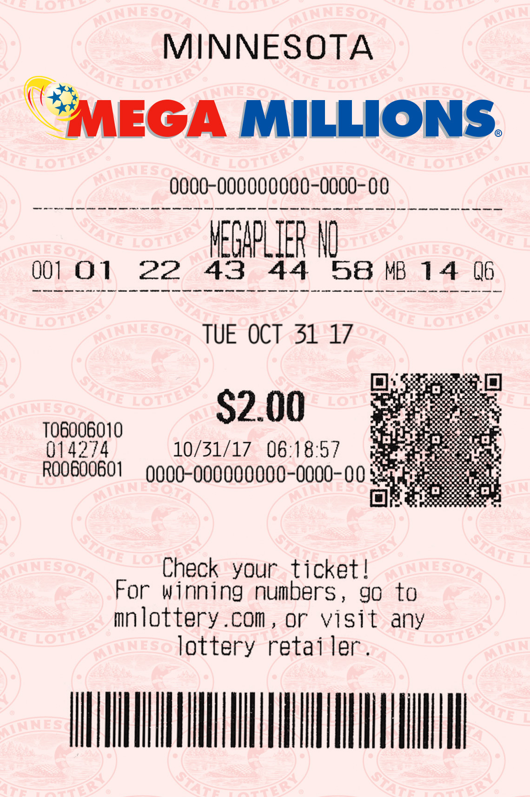

## Mega Millions - Times Series

Mega Millions is an American multi-jurisdictional lottery game.

The csv file contains the winning lottery numbers for Mega Millions from the 17th of May 2002, up until the 30th of June 2020. There are a total of 1889 sets of numbers in the file. The columns are the draw date, the five winning numbers, the 'Mega Ball' number, and from the 18th of January 2011, the 'multiplier'.

source: https://www.kaggle.com/carlmcbrideellis/lottery-mega-millions-winning-numbers
